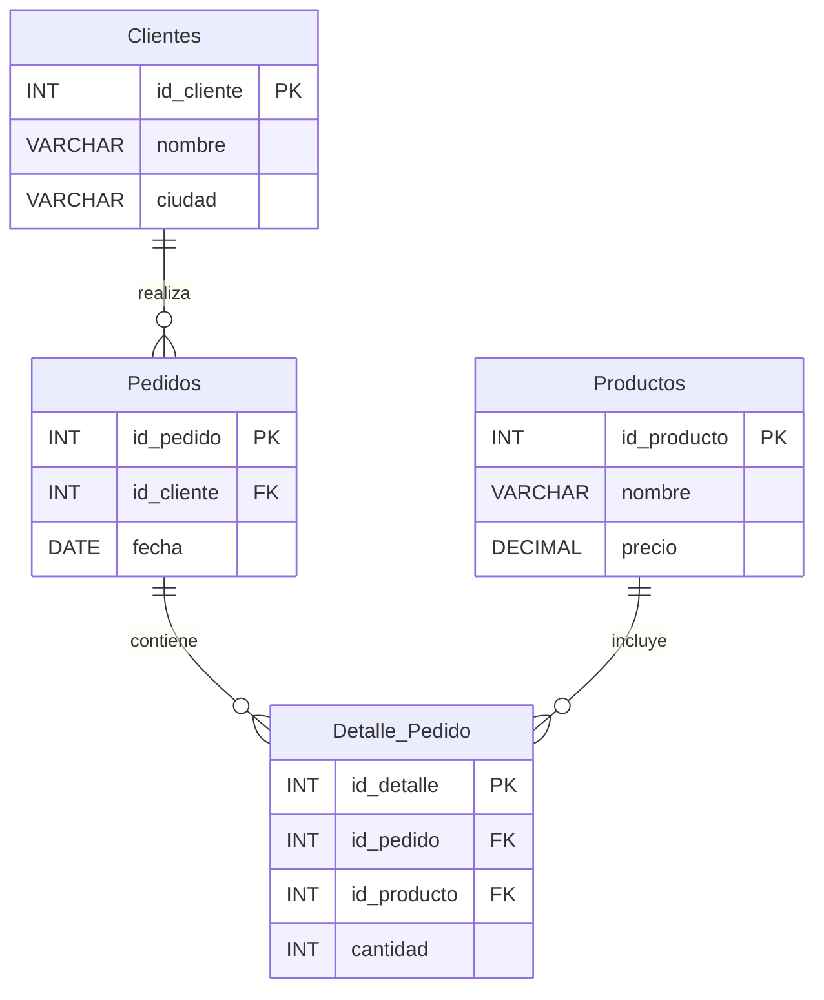

# Ejercicios SQL Semana 5

- Cesar Sebastian Zambrana Ventura

## Diagrama ER:

```mermaid
erDiagram
    Clientes {
        INT id_cliente PK
        VARCHAR nombre
        VARCHAR ciudad
    }

    Productos {
        INT id_producto PK
        VARCHAR nombre
        DECIMAL precio
    }

    Pedidos {
        INT id_pedido PK
        INT id_cliente FK
        DATE fecha
    }

    Detalle_Pedido {
        INT id_detalle PK
        INT id_pedido FK
        INT id_producto FK
        INT cantidad
    }

    Clientes ||--o{ Pedidos : realiza
    Pedidos ||--o{ Detalle_Pedido : contiene
    Productos ||--o{ Detalle_Pedido : incluye
```

## Repo

los ejercicios se encuentran en `/assignment`
